# AWS System Manager 이용하기. 

AWS System Manager 은 콘솔에 들어가서 직접 소프트웨어를 설치하거나, 오퍼레이션을 위한 프로비져닝 툴을 이용하지 않고, AWS Console 상에서 직접 커맨드를 전송하여 EC2 인스턴스에 다양한 일을 수행할 수 있도록 해준다. 

## EC2 인스턴스 실행하기. 

### EC2 인스턴스 생성 

SystemManager 를 활용하기 위해서 EC2 인스턴스를 3개 생성하자. 

- AMI: Amazon Linux 2 
- 인스턴스 유형: t2.micro (free tier)
- 인스턴스 구성: 인스턴스 개수 3개
- 스토리지 추가: 다음 클릭
- 태그 추가: 다음 클릭  
- 보안그룹 추가: TCP/8080/위치무관 추가
- 검토및 시작 

위와 같이 3개의 인스턴스를 생성했다. 

### 태그 추가하기. 

이제 EC2 태그를 추가하자. 

AWS 에서 태그는 Resource 를 식별할 수 있는 도구로 활용되며, 실제 운영에서는 태그를 매우 많이 사용한다. 

인스턴스 체크 > 태그 > 태그 추가/편집 선택후 다음과 같이 태그를 각각 추가한다. 

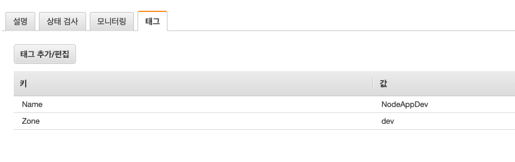

#### 1번 인스턴스 태그 
- Name: NodeAppDev
- Zone: dev

#### 2번 인스턴스 태그
- Name: NodeAppTest
- Zone: dev

#### 3번 인스턴스 태그 
- Name: NodeAppProd
- Zone: prod

위와같이 태그를 작성했다. 

dev 존에는 NodeAppDev와 NodeAppTest 를 만들고. 
prod 존에는 NodeAppProd 를 배치한다는 논리적인 설정을 해 두었다. 

## 리소스 그룹 지정하기. 

dev 존 그룹과, prod 존 그룹을 각각 만들어보자. 

AWS Systems Manager > 리소스 그룹을 클릭한다. 

아래 이미지에서 `리소스 그룹 생성` 을 클릭하자. 
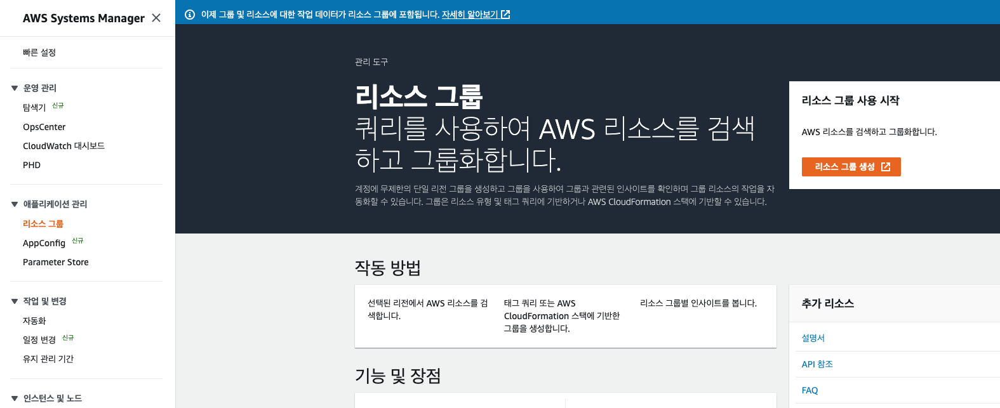


### Dev Zone 그룹 생성하기. 

- 그룹 유형: 태그 기반 
- 리소스 유형: AWS::EC2::Instance 
- 태그 키: Zone
- 태그 값: dev
- 이름: NodeAppDevInstance

아래 이미지와 같이 리소스 그룹을 생성했다. 

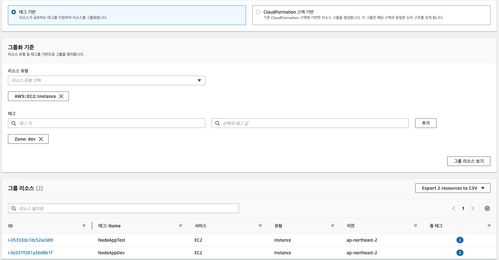

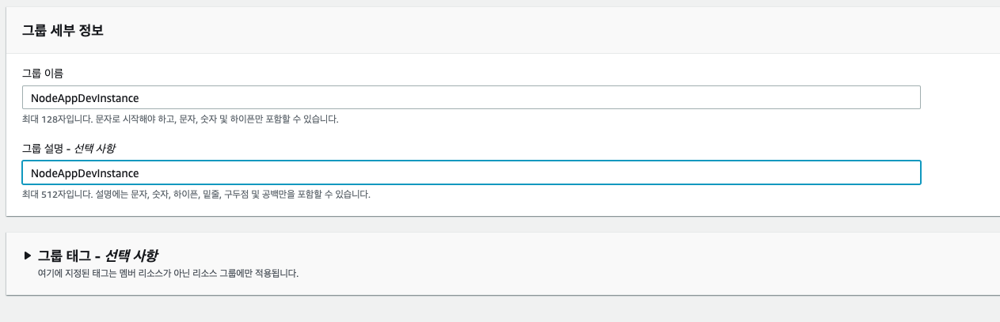

### Prod Zone 그룹 생성하기. 

- 그룹 유형: 태그 기반 
- 리소스 유형: AWS::EC2::Instance 
- 태그 키: Zone
- 태그 값: prod
- 이름: NodeAppProdInstance

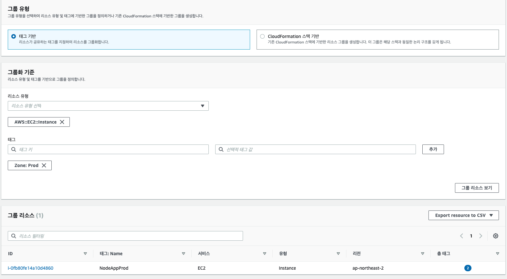

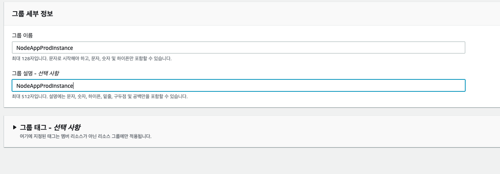

생성된 리소스 그룹을 클릭하면 아래와 같이 전체 리소스 그룹을 볼 수 있다. 

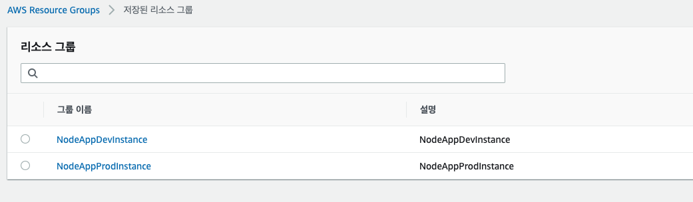

## System Manager Run Command 이용하기. 

AWS Systems Manager > Run Command 를 선택한다. 

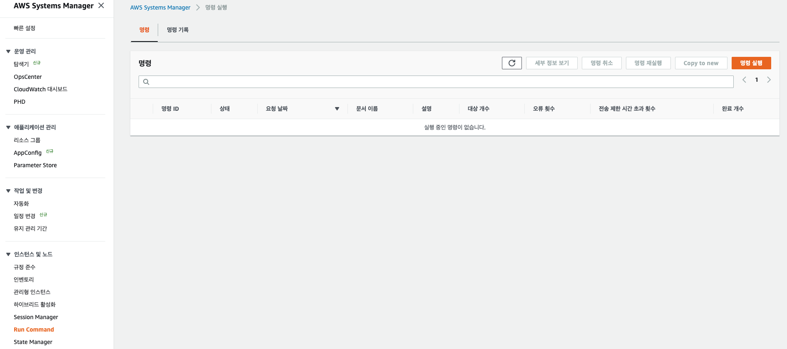


그리고 명령 실행을 클릭하자. 

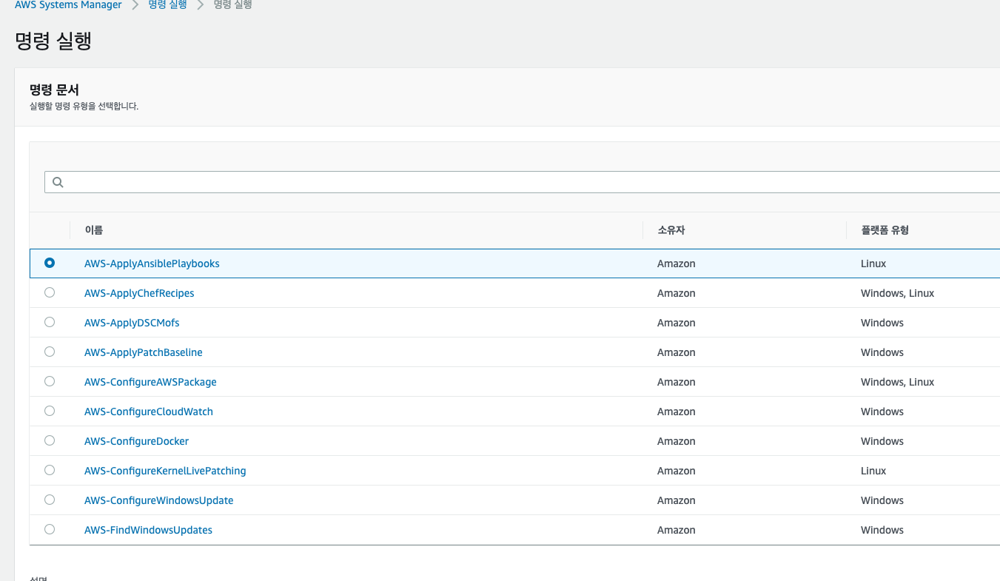

그럼 아래 이미지와 같이 명령 문서들을 선택할 수 있다. AWS 는 이미 만들어둔 다양한 명령 문서들을 제공하고 있으며, 우리는 Node App 을 실행할 것이기 때문에 문서를 만들어 줄 것이다. 

## 명령 실행 문서 작성하기. 

AWS Systems Manager > 문서 를 클릭하자. 

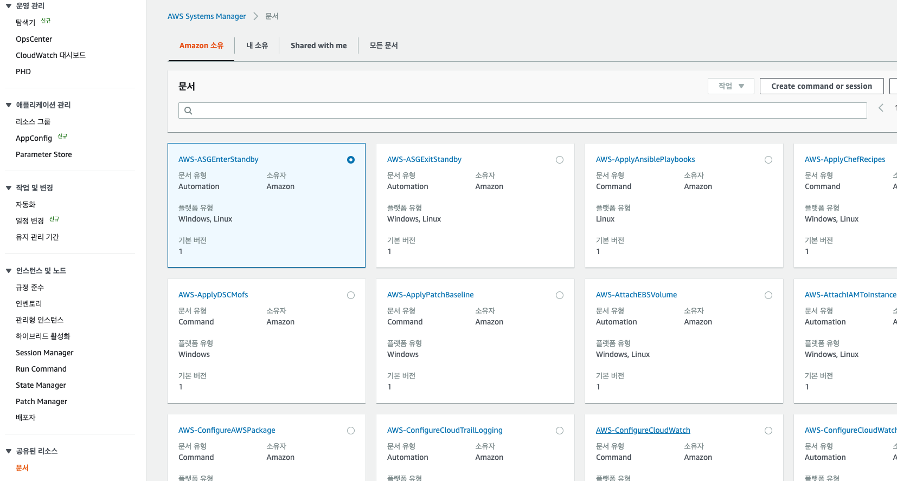

그리고 여기서 `Create command or session' 을 선택한다. 

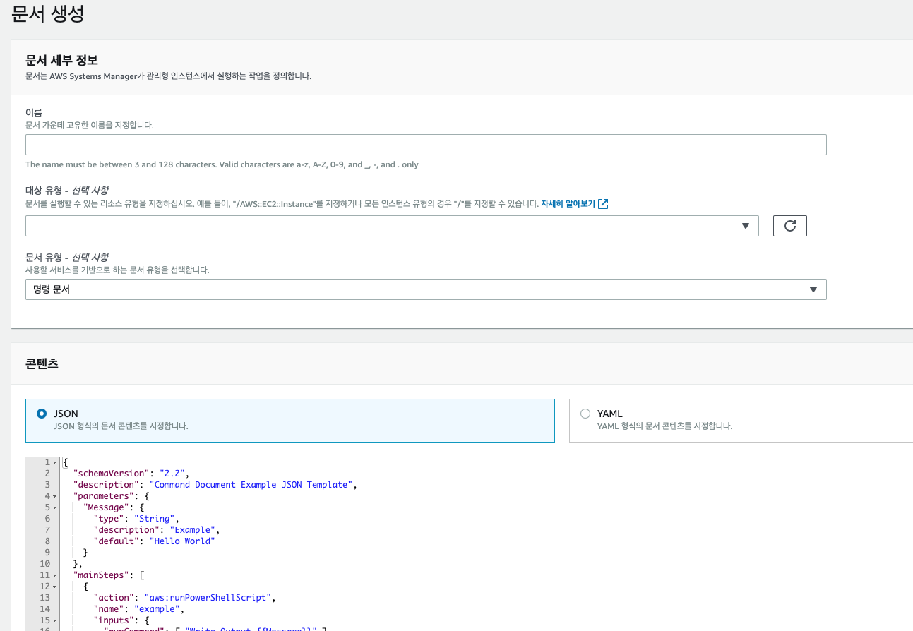

- 이름: InstallNodeAndRunNodeApp
- 대상 유형: /(전체 리소스) 혹은 AWS::EC2::Instance
- 문서 유형: 명령 문서
- 콘텐츠: YAML 

그리고 문서 내용에는 다음과 같이 작성해주자. 

```
---
schemaVersion: "2.2"
description: "Install NodeJS and Run Node Web App"
parameters:
  Message:
    type: "String"
    description: "Example"
    default: "Hello World"
mainSteps:
- action: aws:runShellScript
  name: "installNodejsAndRunApp"
  inputs:
    runCommand:
    - 'sudo yum update -y'
    - 'sudo yum install -y amazon-linux-extras'
    - 'sudo yum install -y https://dl.fedoraproject.org/pub/epel/epel-release-latest-7.noarch.rpm'
    - 'sudo yum install -y epel-release'
    - 'sudo yum install -y nodejs'
    - 'sudo yum install -y git'
    - 'mkdir -p /user/home/ec2-user/app'
    - 'cd /user/home/ec2-user/app'
    - 'git clone https://github.com/schooldevops/AWSNodeExamples.git'
    - 'cd /user/home/ec2-user/app/AWSNodeExamples/AWSUserData/nodesample'
    - 'npm install'
    - 'cp /user/home/ec2-user/app/AWSNodeExamples/AWSUserData/scripts/nodeapp.sh /var/tmp/nodeapp.sh'
    - 'sudo chmod +x /var/tmp/nodeapp.sh'
    - 'cp /user/home/ec2-user/app/AWSNodeExamples/AWSUserData/scripts/nodeapp.service /etc/systemd/system/nodeapp.service'
    - 'systemctl daemon-reload'
    - 'systemctl enable nodeapp.service'
    - 'systemctl start nodeapp.service'

```

위와 같이 작성하고, 생성을 클릭한다. 

## Role 생성 및 등록 

AWS Systems Manger 를 실행하기 위해서는 권한을 부여해야한다. 

IAM > 그룹 > 새로운 그룹 생성 을 클릭한다. 

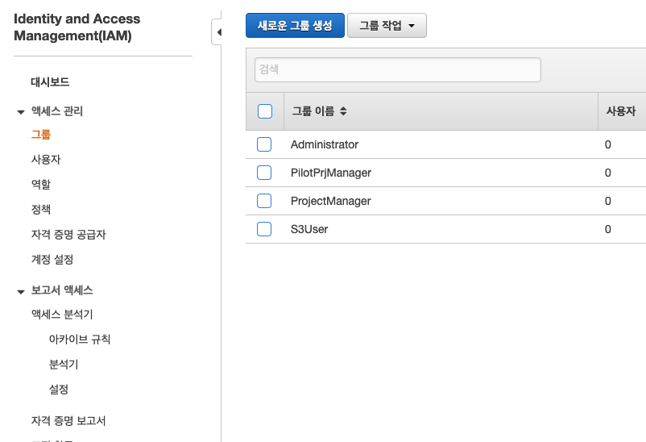

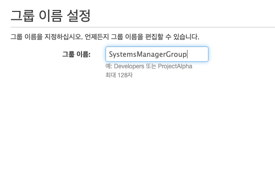

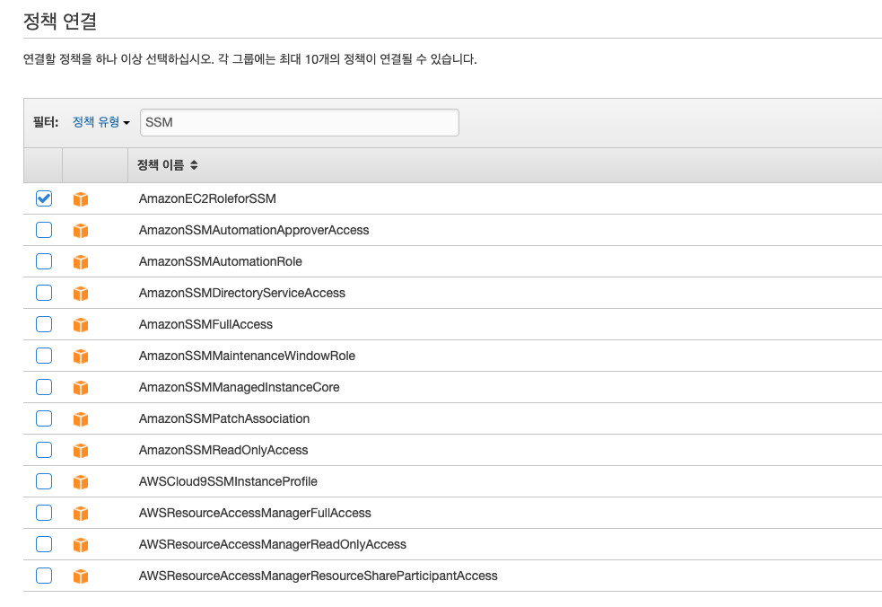

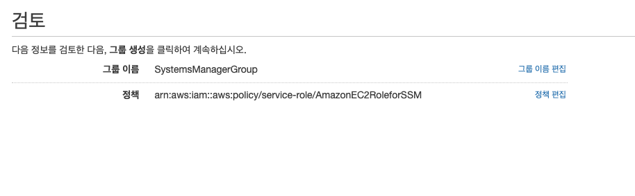

위 단계처럼 롤을 생성해준다. 

### Role 연동하기. 

EC2 > Instance 에서 각 인스턴스를 클릭한다. 

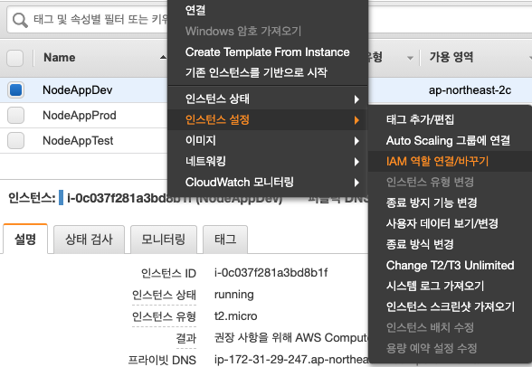

작업 > 인스턴스 설정 > IAM 역할연결/바꾸기 를 클릭한다. 

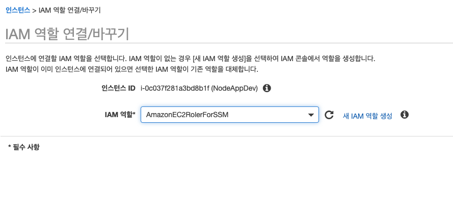

방금 만든 롤을 선택한다. 

## Run Command 실행하기. 

AWS Systems Manager > Run Command > 명령실행 를 클릭한다. 

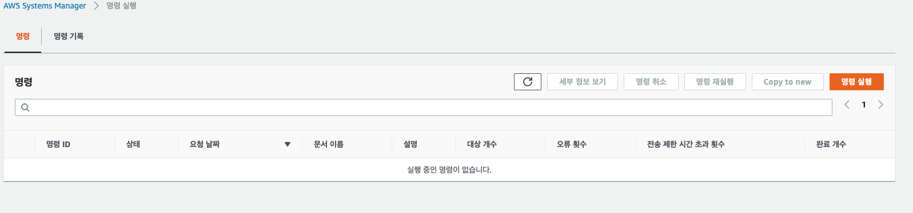

명령 실행에서, 아래 검색 항목에
- 소유자 > 내소유를 선택하면 자신이 만든 문서를 검색할 수 있다. 

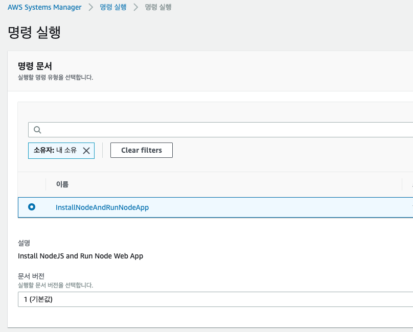

대상 항목에서는 다양한 방법을 이용할 수 있다. 
- 인스턴스 태그 지정: 우리가 지정한 태그키인 Zone, 값인 dev 를 선택하면 될 것이다. 
- 수동으로 인스턴스 선택: 이를 선택하면 우리가 실행하고자 하는 대상을 선택할 수 있다. 
- 리소스 그룹 선택: NodeAppDevInstance 와 같이 리소스 그룹을 직접 선택할 수 있다. 

우리는 리소스 그룹을 선택했다. 

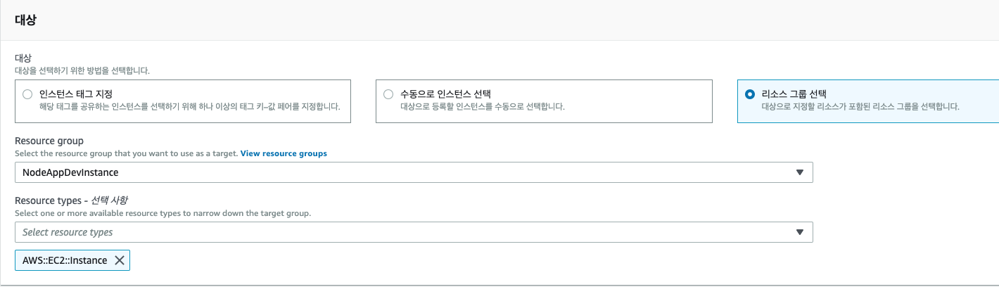

출력 옵션은 S3 버킷에 쓰기는 제거했다. (아카이빙을 하고자 한다면 S3를 활용하면 된다. )

CloudWatch 출력을 클릭하였다. 그리고 로그 그룹을 InstallNodeAndRun 으로 작성했다. 

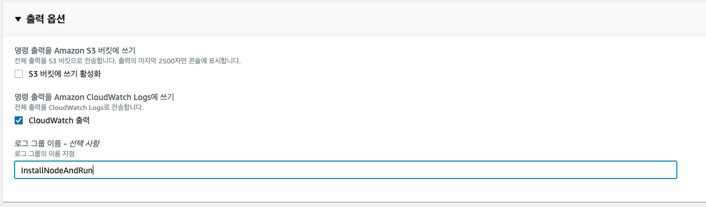

명령을 실행하면 진행중 상태로 나타나게 된다. 

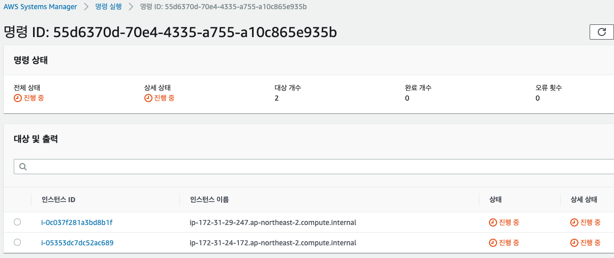

위 과정과 같이 실행 해주었다. 

새로 갱신해보면 다음과 같이 커맨드가 실행된 것을 확인해 볼 수 있다. 

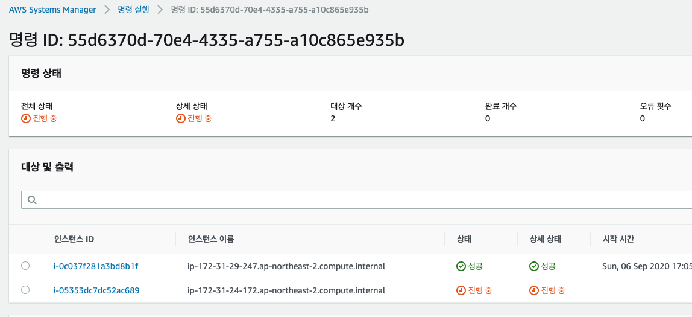

작업이 완료되면, EC2 인스턴스에서 Public IP 를 이용하여 다음에 접속해서 확인해보자. 

http://publicIP:8080

만약 결과가 바로 나오지 않는다면, Security Group 에서 Inbound Goup 규칙을 다음과 같이 편집해주자. 

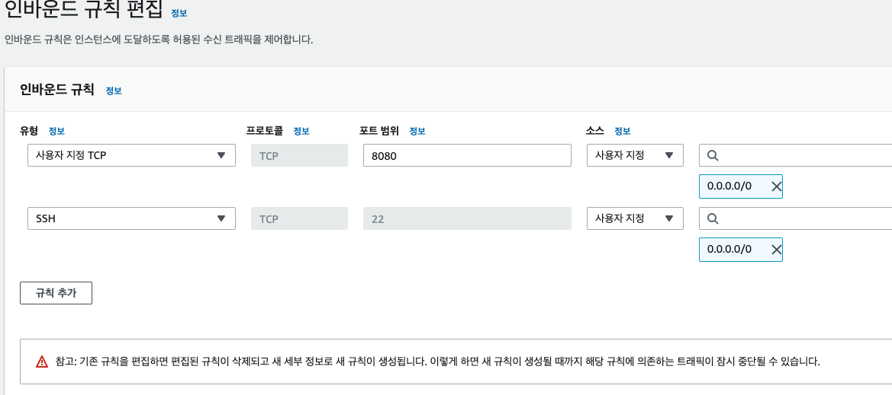

## 커맨드 실행 로그 확인하기. 

우리는 이전에 Run Command 를 수행할 때 Cloud Watch 로 모니터링을 지정했다. 

CloudWatch > 로그 그룹 를 선택하자. 
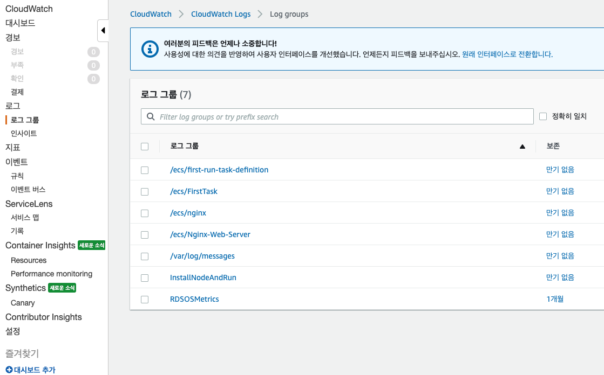

그중 우리가 정의한 로그 그룹인 InstallNodeAndRun 을 클릭한다. 

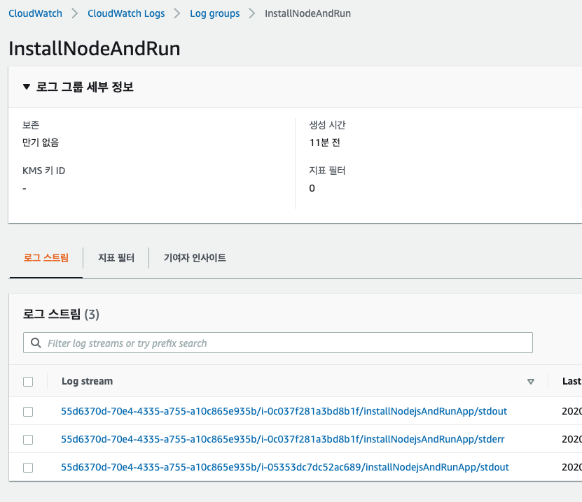

그럼 다음과 같이 실행된 로그를 자세히 확인할 수 있다. 

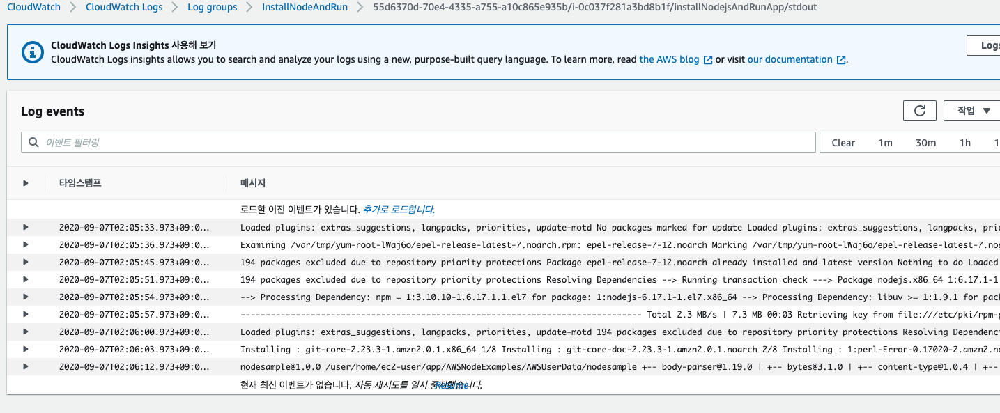


## WrapUP

지금까지 AWS Systems Manager 에서 Run Command 를 살펴 보았다. 

실제 콘솔을 통해서 ssh 접근후 각각 설치해 주어도 되지만, 인스턴스가 여러개가 있다면, 그룹을 만들고, 해당 그룹에 일괄적으로 커맨드를 전송하여 원하는 오퍼레이션을 AWS Systems Manager 를 이용하여 확인해 볼 수 있었다. 

그리고 실행 순서에 따라 로그를 Cloud Watch 에서 확인했다.

이는 운영시 한번에 다수의 인스턴스의 변경을 가하는 매우 편리한 도구이다.

AWS 에서는 다양한 명령 문서들을 제공하고 있으니 하나씩 실펴보면서, 저극 활용하면 도움이 될 것이다. 


