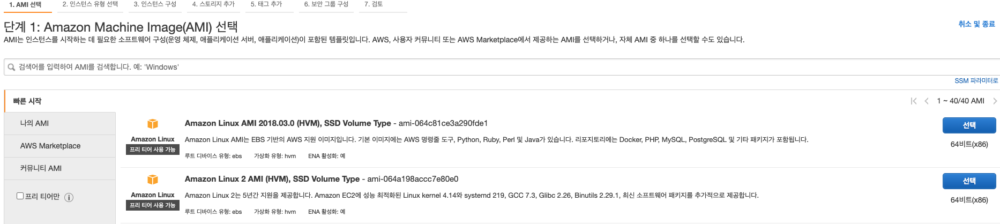
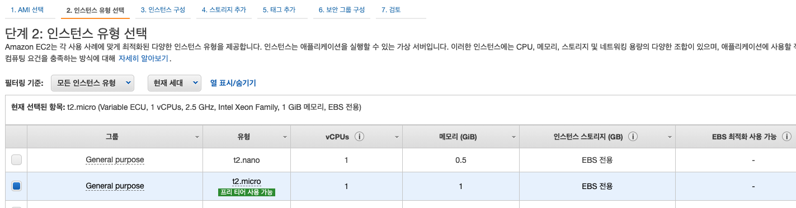
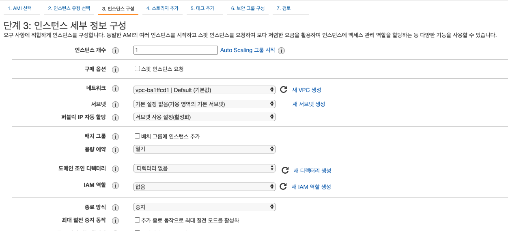
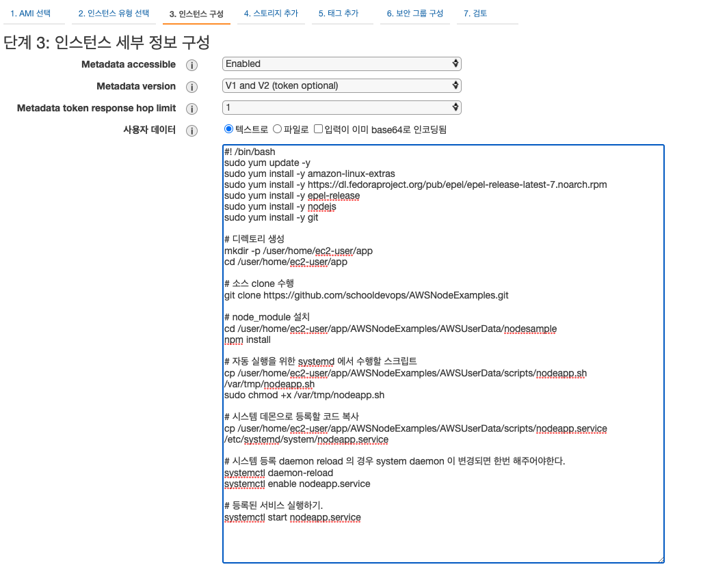
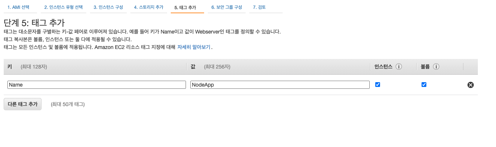
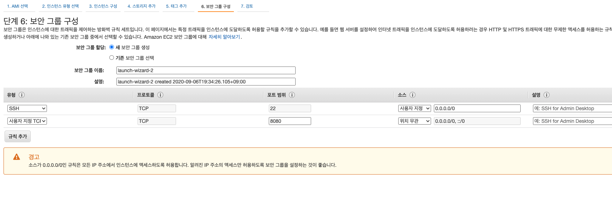
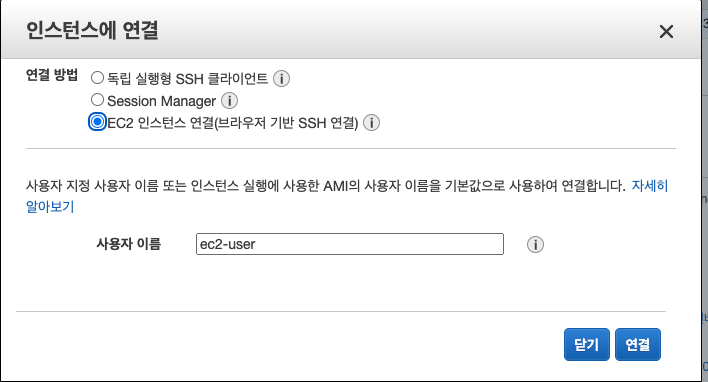

# UserData 를 이용하여, AWS 에 Node 설치 및 실행. 

## Node 프로그램 생성. 

### Mode 설치 

[NodeJS Download](https://nodejs.org/) 에서 NodeJs 를 다운로드 받아 설치한다. 

### Node 개발 준비

```
npm init -y 
```

```
npm install express --save
npm install body-parser --save
```

### Node Express 프로그래밍 

```
const express = require('express');
const bodyParser = require('body-parser');
const port = 8080;

const app = express();

app.use(bodyParser.json());
app.use(bodyParser.urlencoded({
    extended: true
}));

app.get("/", (req, res) => {
    res.send('Hello express!!');
});

app.listen(port, (err) => {
    if (err) {
        console.log(err);
    }

    console.log('Node app is running on port: ' + port);
});
```

### 실행 및 테스트 하기. 

```
node app.js
```

```
curl localhost:8080

Hello express!!
```

## AWS UserData 작성하기. 

UserData.txt

```
#! /bin/bash
sudo yum update -y
sudo yum install -y amazon-linux-extras
sudo yum install -y https://dl.fedoraproject.org/pub/epel/epel-release-latest-7.noarch.rpm
sudo yum install -y epel-release
sudo yum install -y nodejs
sudo yum install -y git

mkdir -p /user/home/ec2-user/app
cd /user/home/ec2-user/app

git clone https://github.com/schooldevops/AWSNodeExamples.git

cd AWSNodeExamples/AWSUserData/nodesample
npm install 

node app.js 

```

- 우선 yum 으로 패키지를 업데이트 한다. 
  ```
    sudo yum update -y
  ```
- 다음으로 amazon-linux-extras 를 설치한다. 
  ```
    sudo yum install -y amazon-linux-extras
  ```
- nodejs 를 설치하기 위해서 epel-release 를 설치한다. 
  ```
    sudo yum install -y https://dl.fedoraproject.org/pub/epel/epel-release-latest-7.noarch.rpm
    sudo yum install -y epel-release
  ```
- nodejs 를 설치한다. 
  ```
    sudo yum install -y nodejs
  ```
- source 를 가져오기 위해서 git 을 설치한다. 
  ```
    sudo yum install -y git
  ```
- 디렉토리를 생성하고, 소스를 clone 한 후, node 를 실행하도록 한다. 
  ```
    mkdir -p /user/home/ec2-user/app
    cd /user/home/ec2-user/app

    git clone https://github.com/schooldevops/AWSNodeExamples.git

    cd AWSNodeExamples/AWSUserData/nodesample
    npm install 

    node app.js 
  ```

## EC2 인스턴스 생성하기. 

### 인스턴스 이미지 선택 
Amazon Linux 2 를 선택한다. 


### 인스턴스 유형 선택하기. 

인스턴스 유형은 FreeTier 인 t2.micro 를 선택한다. 
우리는 돈이 없으니까. ^^



### 인스턴스 구성은
인스턴스 구성은 아래와 같으며, 제일 밑으로 스크를 하여 `사용자 데이터` 부분에 아래 코드를 추가하자. 



참고로 아래 샘플은 UserData2.txt 의 내용인 최종 소스이다. 


### 태그 달기 
태그를 아래와 같이 달아준다. 

AWS 에서 태그는 리소스를 식별하는 강력한 방법을 제공한다. 


### 보안 그룹을 작성한다. 
보안 그룹중에서 TCP 8080 포트를 추가해주자. 

우리의 nodeapp 이 8080 포트로 실행되기 때문에 테스트를 위해서 8080 을 열어준 것이다. 


### 인스턴스 연결하는 방법 

인스턴스를 클릭하고 > 연결 을 하면 아래와 같은 팝업이 뜬다. 

우리는 키페어 없이 EC2 인스턴스 연결(브라우저 기반 SSH연결) 이용할 수 있다. 


## 테스트하기. 
이제 테스트를 수행해보자. 
인스턴스의 public ip 를 복사하고. 

```
https://<public_ip>:8080 을 해보자. 

Hello express!! 
```

Hello express!! 가 나오면 정상이다. 

우리는 userData 를 이용하여 필요한 어플을 설치하고, 소스를 clone 하는 등의 작업을 했다. 

## 참고
userData 는 인스턴스가 생성될때 딱 한번 실행된다. 
다시 node 를 실행하기 위해서는 서버가 실행될때 등록을 해주거나 다시 콘솔에 접속해서 node 를 실행해 주어야한다. 

예제를 위해서 인스턴스를 중지(Stop) 하거나, 재실행(Restart) 을 하면 브라우저로 접근해도 node 서버가 동작하지 않음을 알 수 있다. 

```

       __|  __|_  )
       _|  (     /   Amazon Linux 2 AMI
      ___|\___|___|

https://aws.amazon.com/amazon-linux-2/
No packages needed for security; 2 packages available
Run "sudo yum update" to apply all updates.
[ec2-user@ip-172-31-27-161 ~]$ sudo su
[root@ip-172-31-27-161 ec2-user]# ls
[root@ip-172-31-27-161 ec2-user]# cd /user/home/ec2-user/

[root@ip-172-31-27-161 ec2-user]# cd app/
[root@ip-172-31-27-161 app]# ls
AWSNodeExamples

[root@ip-172-31-27-161 app]# cd AWSNodeExamples/
[root@ip-172-31-27-161 AWSNodeExamples]# ls
AWSUserData

[root@ip-172-31-27-161 AWSNodeExamples]# cd AWSUserData/
[root@ip-172-31-27-161 AWSUserData]# cd nodesample/
[root@ip-172-31-27-161 nodesample]# ls
app.js  node_modules  package.json  package-lock.json

[root@ip-172-31-27-161 nodesample]# node app.js
Node app is running on port: 8080
```

위와 같이 다시 실행하면 새로 생성된 ip 에 접근하면 같은 결과를 확인할 수 있다. 

## 새로 변경된 UserData 살펴보기 

UserData2.txt 코드를 다음과 같이 작성했다. 
다음 코드는 systemd 에 서비스를 등록하고, 부트시 실행하도록 잡아 주었다. 

### UserData2.txt 파일 

```
#! /bin/bash
sudo yum update -y
sudo yum install -y amazon-linux-extras
sudo yum install -y https://dl.fedoraproject.org/pub/epel/epel-release-latest-7.noarch.rpm
sudo yum install -y epel-release
sudo yum install -y nodejs
sudo yum install -y git

# 디렉토리 생성 
mkdir -p /user/home/ec2-user/app
cd /user/home/ec2-user/app

# 소스 clone 수행 
git clone https://github.com/schooldevops/AWSNodeExamples.git

# node_module 설치 
cd /user/home/ec2-user/app/AWSNodeExamples/AWSUserData/nodesample
npm install 

# 자동 실행을 위한 systemd 에서 수행할 스크립트 
cp /user/home/ec2-user/app/AWSNodeExamples/AWSUserData/scripts/nodeapp.sh /var/tmp/nodeapp.sh
sudo chmod +x /var/tmp/nodeapp.sh

# 시스템 데몬으로 등록할 코드 복사 
cp /user/home/ec2-user/app/AWSNodeExamples/AWSUserData/scripts/nodeapp.service /etc/systemd/system/nodeapp.service

# 시스템 등록 daemon reload 의 경우 system daemon 이 변경되면 한번 해주어야한다. 
systemctl daemon-reload
systemctl enable nodeapp.service

# 등록된 서비스 실행하기. 
systemctl start nodeapp.service

```

### nodeapp.sh 파일

nodeapp.sh 파일은 서비스를 실행하는 스크립트이다. 

```
#! /bin/bash

sudo su -
cd /user/home/ec2-user/app/AWSNodeExamples/AWSUserData/nodesample
node app.js
```

### nodeapp.service 파일

nodeapp.service 파일은 systemd 에 등록될 서비스 디스크립션이다. 
반드시 /etc/systemd/system/ 디렉토리 내에 존재해야한다. 

```
# vi /etc/systemd/system/nodeapp.service
[Unit]
Description=MyNodeApp

[Service]
Type=simple
ExecStart=/var/tmp/nodeapp.sh
TimeoutStartSec=0

[Install]
WantedBy=default.target

# systemctl daemon-reload
# systemctl enable nodeapp.service
# systemctl start nodeapp.service
```

### 다시 EC2 인스턴스 UserData 를 작성
다시 인스턴스를 생성 해보면 정상적으로 동작함을 확인할 수 있다. 
이제는 서비스를 리스타트 해도 정상으로 node 앱이 수행된다. 
